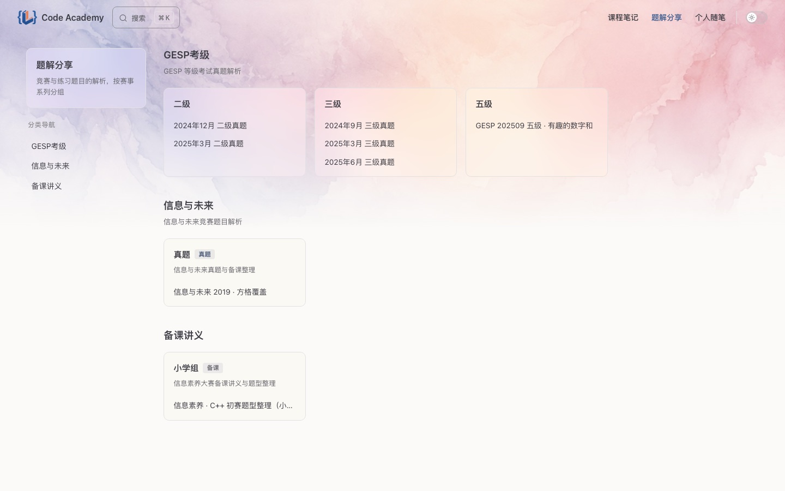
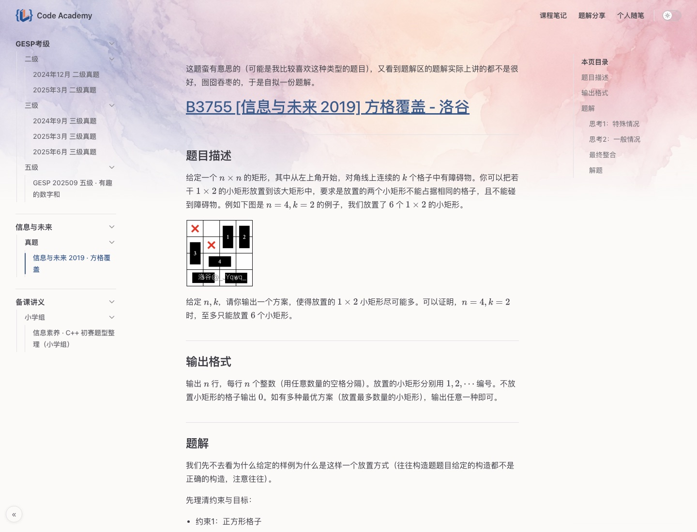
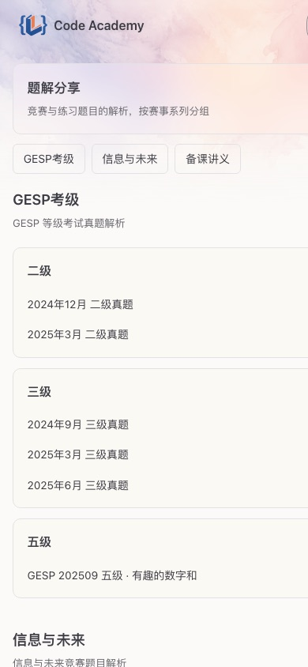

# Code Academy

教学笔记与题解的发布站点。基于 VitePress 构建的纯静态站，配套一个本地上传后台，经 Cloudflare 对外。

## 截图

| 首页 | 板块页（题解分享） |
|---|---|
|  |  |

| 文档阅读页 | 移动端 |
|---|---|
|  |  |

## 特性

- **三大独立板块**：课程笔记 / 题解分享 / 个人随笔，互不交叉，各自独立页面。
- **四层内容结构**：板块 → 栏 → 框 → 文章，目录即结构，零配置。
  - 例：`题解分享 → GESP考级 → 二级 → 某真题`
- **卡片式导航**：每个「框」是一张卡片（四联网格），含标题、标签、描述、文章列表。
- **完整渲染**：Markdown、代码高亮、KaTeX 公式、表格、PDF 内嵌、HTML 演示内嵌。
- **视觉**：顶部水彩背景、毛玻璃卡片、莫兰迪点缀色、左右目录可折叠。
- **移动端适配**：响应式布局，目录抽屉、卡片单列、代码/公式横向滚动。
- **上传后台**：拖文件 + 逐级选板块/栏/框 + 发布，自动转换落位。
- **静态 + 安全**：无数据库、无公网后端，攻击面极小，最适合 Cloudflare 缓存。

## 技术栈

- [VitePress](https://vitepress.dev/) 1.6 — 静态站生成
- 自定义主题（`docs/.vitepress/theme/`）— SectionView 卡片布局、毛玻璃、折叠
- markdown-it-mathjax3 — 数学公式
- Node 内置 http — 零依赖上传后台

## 目录结构

```
docs/
  .vitepress/
    config.mjs          站点配置（导航、搜索、favicon）
    sidebar.mjs         递归扫描目录生成四层结构
    theme/
      SectionView.vue   板块页（栏→框卡片网格）
      CustomLayout.vue  折叠按钮、文档页判定
      style.css         全部自定义样式
  notes/                课程笔记   板块/栏/框/文章.md
  solutions/            题解分享
  research/             个人随笔
  public/               logo、favicon、水彩背景、图片、PDF、演示
admin/
  server.mjs            上传后台服务
  upload.html/js        上传页面
scripts/
  import-note.mjs       命令行导入（Obsidian md → VitePress）
  lib/convert.mjs       转换核心（CLI 与后台共用）
deploy/                 Docker + nginx + Cloudflare 部署（见 deploy/README.md）
```

## 本地开发

```bash
npm install
npm run dev        # 开发服务器 http://localhost:5173
npm run build      # 构建到 docs/.vitepress/dist
npm run preview    # 预览构建产物
```

## 内容管理

### 方式一：上传后台（推荐）

```bash
ADMIN_PASSWORD=你的密码 npm run admin
# 浏览器开 http://127.0.0.1:4321，密码登录
```

拖入 `.md`/`.pdf`/`.html` → 填标题 → 逐级选板块/栏/框（可新建）→ 发布。
后台自动处理 Obsidian 图片语法、frontmatter、`{{` 转义、文件名规范化。

> 后台仅监听本地回环，公网使用需经 SSH 隧道或 Cloudflare Access。

### 方式二：命令行导入

```bash
node scripts/import-note.mjs "源文件.md" solutions/GESP考级/二级 --title "标题"
```

### 方式三：直接放文件

把 md 放进 `docs/<板块>/<栏>/<框>/` 目录，侧边栏与卡片自动生成。
文件夹可放 `_meta.json` 配置描述/标签/排序：

```json
{ "description": "一句话介绍", "tag": "进行中", "tagType": "new", "order": 1 }
```

## 部署

见 [deploy/README.md](deploy/README.md) — Docker + nginx 托管，Cloudflare 缓存/防护/隐藏源站。

```bash
bash deploy/deploy.sh   # 本地构建 → 同步服务器 → 重启容器
```
